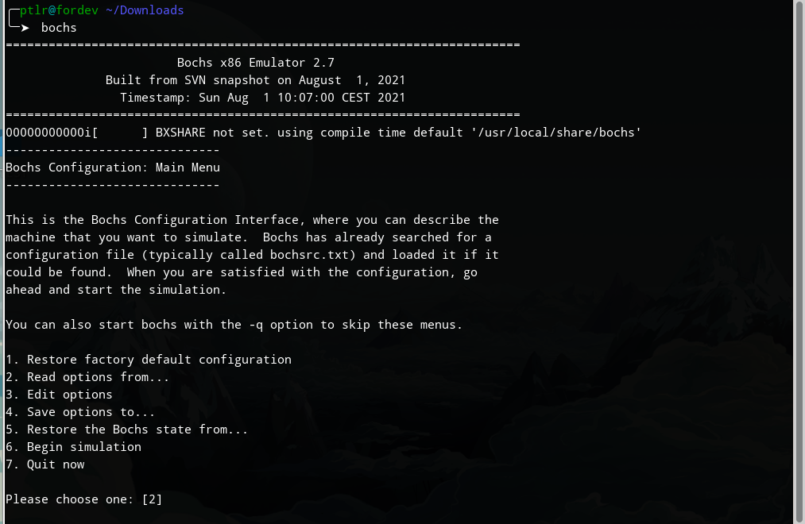

# <h1 align="center">001 开发环境搭建</h1>

俗话说，工欲善其事，必先利其器，虽然已经迫不及待地想要开始开发自己的操作系统，但没有合适的工具与环境寸步难行，因此，还是要准备环境。

## 1 工具说明

| 工具         |   工具版本    | 说明                                                         | 备注                           |
| ------------ | :-----------: | ------------------------------------------------------------ | ------------------------------ |
| debian       | trixie（sid） | GNU/Linux下开发工具齐全，安装方便，后期会使用ELF格式的文件，无需折腾开发环境。 | 也可选在其他操作系统平台下开发 |
| gcc          |    13.2.0     | C语言编译器                                                  |                                |
| bochs        |      2.7      | x86模拟器                                                    | qemu作为备选                   |
| make         |      4.3      | 项目管理                                                     |                                |
| nasm/ndisasm |    2.16.01    | 汇编编译器/汇编反编译器                                      |                                |
| Binutils     |               | GUN二进制工具集                                              |                                |

## 2 环境配置

### 2.1 安装gcc

```bash
sudo apt install gcc -y
```

### 2.2 安装nasm

```bash
sudo apt install nasm -y
```

### 2.3安装Binutils

```bash
sudo apt install binutils -y
```

### 2.4 安装make

```bash
sudo apt install make -y
```

### 2.5 bochs安装

bochs采取源码编译安装的方式，这样可以方便的启用或关闭相应的功能。

此前已经安装好了`make`,为了编译`bochs`还需要安装一些工具及库。

* 工具以及库安装

```bash
# g++:bochs编译工具
sudo apt install g++ -y
# readline库,用于开启bochs历史命令功能，自动检测开启
sudo apt install libreadline-dev libreadline8 -y
# 安装xorg-dev： bochs需要的图形界面库
sudo apt install xorg-dev -y
```

* 准备源码

```bash
# 解压出bochs源码
tar zxvf Bochs-REL_2_7_FINAL.tar.gz
# 切换至源代码目录
cd ./Bochs-REL_2_7_FINAL/bochs/
```


* 配置编译参数

```bash
#--enable-debugger 开启自带的debug功能
#--enable-iodebug 启用io接口调试器
#--enable-x86-debugger 启用x86调试支持
#--with-x 使用X windowx
#--with-x11 使用X11图形用户接口
./configure \
--enable-debugger \
--enable-iodebug \
--enable-x86-debugger \
--with-x \
--with-x11
```

* 编译

```bash
# 启用四个线程编译
make -j4
```

* 安装

```bash
sudo make install
```

## 3 环境测试

### 3.1启动测试

```bash
bochs
```

